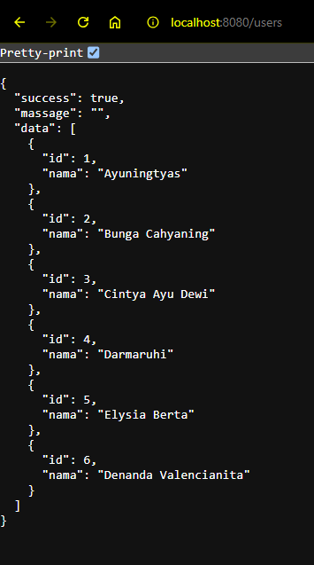

# GIN GONIC

Repository ini berisi tentang cara membuat endpoint menggunakan salah satu framework web untuk Golang yaitu Gin Gonic.

# Step By Step
## 1. Membuat Struct
buat sebuah struct dengan menggunakan `json` agar dapat dikonfersi menjadi JSON untuk menerima request dan mengirim respon
``` Go
type User struct {
	Id   int    `json:"id" validate:"gt"`
	Nama string `json:"nama" validate:"required,min=3,max=20"`
}
```
`validate` digunakan sebagai validasi untuk tiap key pada struct tersebut. documentasi lengkapnya ada di sini [Go Validate](https://pkg.go.dev/github.com/go-playground/validator).

## 2. Siapkan datanya
buat variabel berisi user-user
``` Go
var Users []User = []User{
	{
		Id:   1,
		Nama: "Ayuningtyas",
	},
	{
		Id:   2,
		Nama: "Bunga Cahyaning",
	},
	{
		Id:   3,
		Nama: "Cintya Ayu Dewi",
	},
	{
		Id:   4,
		Nama: "Darmaruhi",
	},
	{
		Id:   5,
		Nama: "Elysia Berta",
	},
	{
		Id:   6,
		Nama: "Denanda Valencianita",
	},
}
```
data tersebut yang akan kita manipulasi melalui Endpoint yang akan kita buat setelah ini

## 3. Buat struct untuk Response
``` Go
type Ressponse struct {
	Success bool   `json:"success"`
	Massage string `json:"massage"`
	Data    any    `json:"data"`
}
```
struct tersebut digunakan sebagai template untuk response

## 4. Import Gin dan buat gin Engine

Pastikan sudah menginstal gin gonic, jika belum instal dulu
``` bash
go get github.com/gin-gonic/gin
```
lalu buat gin Engine di dalam fungsi main
``` Go
r := gin.Default()
```

## Buat Endpoint
dengan variabel `r` tersebut, kita dapat menambahkan HTTP method seperti `GET`, `PUSH`, `PUT`, `PATCH`, `DELETE`. misalnya kita buat method `GET` dan endpoint `/users` untuk menampilkan semua user
``` Go
	r.GET("/users", func(ctx *gin.Context) {})
```
kita telah membuat sebuah endpoint `/users` menggunakan method `GET`. tapi fungsinya masih kosong.

## Buat Handler
setelah endpoint berhasil dibuat, selanjutnya buat fungsi tersebut menjadi berfungsi.
``` Go
	r.GET("/users", func(ctx *gin.Context) {
		ctx.JSON(200, Ressponse{
			Success: true,
			Data:    Users,
		})
	})
```
kita menggunakan `ctx.JSON` untuk membuat respon berupa JSON.
`ctx.JSON` memiliki 2 parameter yaitu code HTTP Method dan Struct
code `200` memiliki arti status OK. 
lalu ada struct Ressponse yang kita buat untuk menampilkan response berupa json

## Bagian terakhir, devinisikan port agar dapat diakses
dengan cara
``` Go
	r.Run(":8080")
```
artinya endpont kita berjalan di port `8080`.

## Hit endpoint tersebut
bisa langsung di chrome


atau menggunakan REST Client dan lainnya